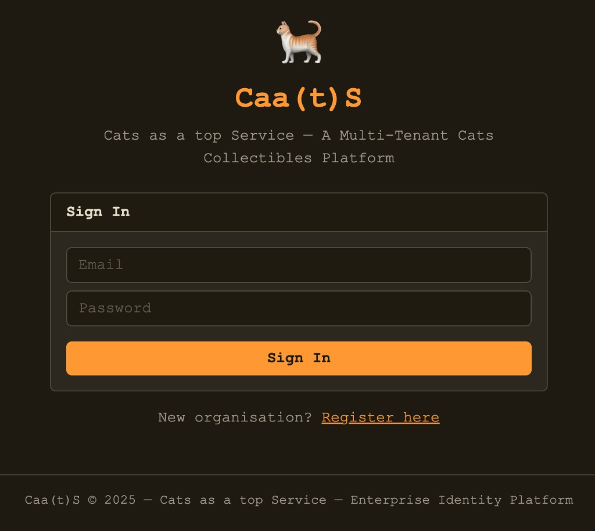

# .: IaC Lab #4 - Vulnerable Multi-SSO Scenario :.

**Brief lab description:** The deployed infrastructure will run a simple application designed to demonstrate multi-tenant sign-in and federated identity with AWS Cognito. Can you find the misconfigurations and escalate your privileges?



### Requirements
- The [AWS CLI](https://docs.aws.amazon.com/cli/latest/userguide/install-cliv2.html) installed
- [AWS account](https://aws.amazon.com/free) and [associated credentials](https://docs.aws.amazon.com/general/latest/gr/aws-sec-cred-types.html) that allow you to create resources
- The [Terraform CLI](https://learn.hashicorp.com/tutorials/terraform/install-cli?in=terraform/aws-get-started)  installed and [configured](https://registry.terraform.io/providers/hashicorp/aws/latest/docs#authentication-and-configuration) to work with AWS
  
**Note:** The application runs in a container image fetched from the public Doyensec Amazon Elastic Container Registry  (ECR). The web application code is also present in this repository for an eventual local deployment.  

### Deployment

*Caa(t)S lab deployment*

```bash
$ git clone https://github.com/doyensec/cloudsec-tidbits.git

$ cd cloudsec-tidbits/lab-maSSO/terraform/
$ bash deploy.sh
```
